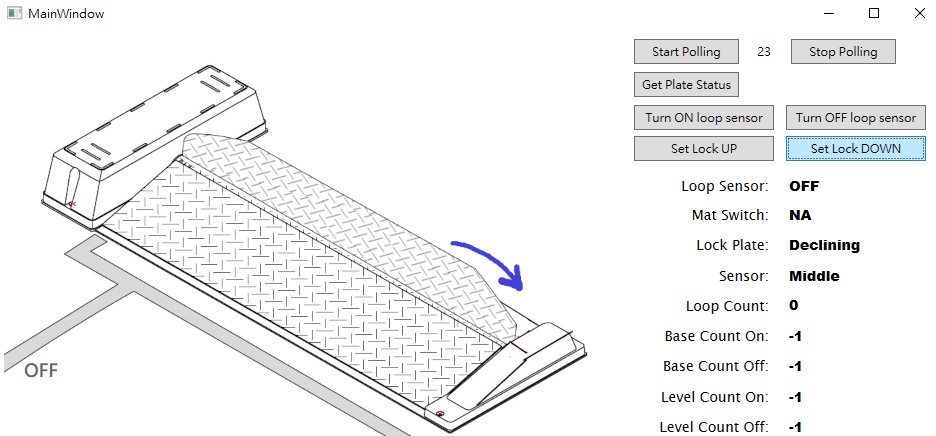

# WebSimulateSNP42X
An emulator based on SNP42XSimulator and can be configured and controlled via webservice.

## Setup
1. Install .NET  
    SNP42XSimulator needs .NET environment to work.
2. Set up Virtual serial port  
    Set up two virtual serial ports and make them connected, so that you can do developing tasks on your laptop and don't need a real SNP42X.
    * On Windows, install [com0com](https://sourceforge.net/projects/com0com/) and set a pair of virtual serial ports.
    * On Linux, install package [tty0tty](https://github.com/freemed/tty0tty) and set a pair of virtual serial ports.
    * On MacOS, I cannot find a way that make two connected virtual serial ports communicate in the meantime. But developer could use a USB serial port and set WebSimulateSNP42X to connect it, then send commands to the USB serial port.
3. Install cURL  
    SNP42XSimulator can be controlled via webservice. cURL is a command-line tool for sending http messages, and we can test SNP42XSimulator with it easily.
    * On Windows 10/11, curl is built-in.
    * On Linux, you can get curl package for your linux distribution easily.
    * On MacOS, you can install cURL with Homebrew.

## Usage
1. Set com port name as one of virtual serial ports in file **appsettings.json**.  
    On Windows, the name usually is COM[num] like COM2, COM10.  
    On Linux, tty0tty makes the name like /dev/tnt[num].  
    ```
    {
      "Settings": {
        "ComportName": "/dev/tnt1"
      }
    }
    ```
2. Start WebSimulateSNP42X  
    On Windows, just execute WebSimulateSNP42X.exe.  
    On Linux, input the following command in console.
    ```
    dotnet WebSimulateSNP42X.dll
    ```
3. Config and open com port      
    1. Add a SNP42X simulator as address #1 to WebSimulateSNP42X  
    ```
    curl -X PUT -H "Content-Type: application/json" -d "{\"address\":\"1\"}" http://localhost:8080/parkingLot/addParkingSpace
    ```
    Add multiple SNP42Xs as address #2, #10 ...
    ```
    curl -X PUT -H "Content-Type: application/json" -d "{\"address\":\"2\"}" http://localhost:8080/parkingLot/addParkingSpace
    curl -X PUT -H "Content-Type: application/json" -d "{\"address\":\"10\"}" http://localhost:8080/parkingLot/addParkingSpace
    ...
    ```
    "Code = 0" returned means the task done without problem.
    ```
    {"code":0,"msg":""}
    ```
    2. Open com port to receive request
    ```
    curl -X POST http://localhost:8080/parkingLot/start
    ```
    3. You could check WebSimulateSNP42X status with the command  
    ```
    curl -X GET http://localhost:8080/parkingLot/
    ```
    In the meantime, it just outputs amount of the SNP42X simulator  
    ```
    {"spaces":3}
    ```
4. Test with SanicaSNP42XConsole  
    Start SanicaSNP42XConsole with parameter "port" to connect another virtual serial port.
    ```
    // on Windows
    SanicaSNP42XConsole.exe --port COM11 --address 1

    // on Linux
    dotnet SanicaSNP42XConsole.dll --port /dev/tnt2 --address 1   
    ```
    The console shows the prompt:
    ```
    Command List: (Input 1~6, c, x)
    Send Command:
            1) Polling
            2) Get Plate Status
            3) Set Loop Sensor On
            4) Set Loop Sensor Off
            5) Set Locking Ctrl Up
            6) Set Locking Ctrl Down
    c) Show Command List
    x) Exit

    Enter (1~6, c, x):
    ```
    For example, key in '1' and enter, you get
    ```
    Addr#1: Send Polling command.
    Receivied: Addr 1
            Loop Sensor Status: OFF
            Mat Switch Status: NA
            Lock Plate Status: StandBy
            Sensor Status: BottomEnd
            Loop count: 1
            Base count: ON: -1, OFF: -1
            Level count: ON: -1, OFF: -1
    ```
5. Change loop sensor status  
    ```
    curl -X POST http://localhost:8080/parkingLot/setLoopSensorON
    curl -X POST http://localhost:8080/parkingLot/setLoopSensorOFF
    curl -X POST http://localhost:8080/parkingLot/setLoopSensorNA
    curl -X POST http://localhost:8080/parkingLot/setLoopSensorERROR
    ```
6. Disable the serial port communication
    ```
    curl -X POST http://localhost:8080/parkingLot/stop
    ```
7. Or you can test with SanicaSNP42XDemo, which works on Windows only.


## To do
* Display more information on WebSimulateSNP42X's status
* Support more abnormal status to set